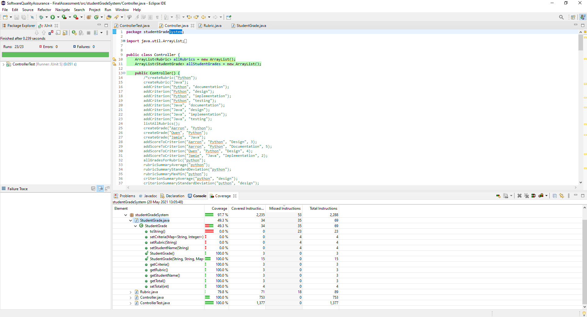
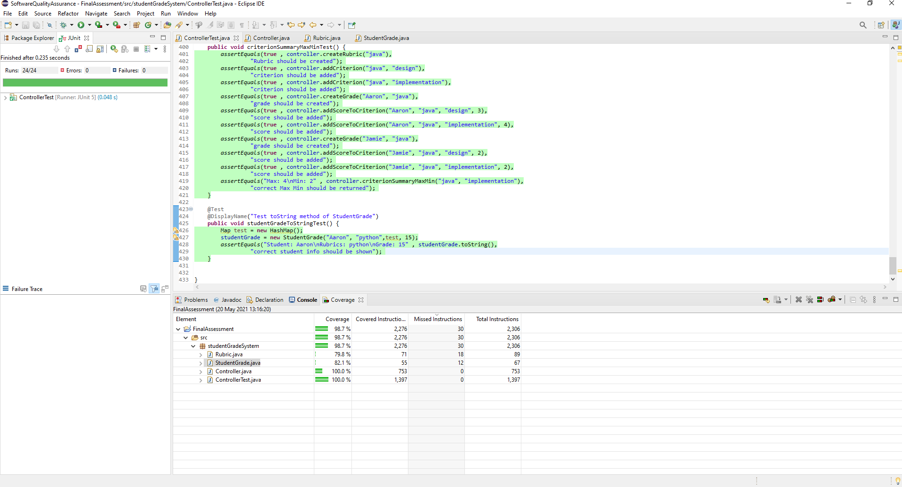

# 1. Scrum Sprint Backlog and Task Estimation  
### Task Estimation:  
Create java objects for Rubric, and StudentGrade. <b>[1 Hour]</b> 
Create Controller class that does the following: <b>[17 Hours]</b> 
- Create new Rubric <b>[1 Hour]</b>
- Add a Criterion to Rubric <b>[2 Hours]</b>
- Get a list of all Rubrics <b>[1 Hour]</b>
- Get specific Rubric by name <b>[2 Hours]</b>
- Create a new StudentGrade <b>[1 Hour]</b>
- Add a score for a particular Criterion to Grade <b>[2 Hours]</b>
- Get all student grades associated to a rubric <b>[2 Hours]</b>
- Summary calculation for Rubric: <b>[3 Hours]</b>
  - Average <b>[1 Hour]</b>
  - Standard deviation <b>[1 Hour]</b>
  - Minimum and maximum score <b>[1 Hour]</b>
- Summary calculation for Criterion of Rubric: <b>[2 Hours]</b>
  - Average <b>[40 Mins]</b>
  - Standard deviation <b>[40 Mins]</b>
  - Minimum and maximum score <b>[40 Mins]</b>

 
These estimates were chosen based off prior experience of developing code to tackle similar problems, while also taking into consideration test-driven development, and the added time that comes with writing these tests. I have also put down shorter times for implementaing summary calculations for a specific criterion as I will be able to use mostly the same code as I used for summary calculations of a rubric.
 
<b>Velocity Metric</b> 
Sprint velocity refers to teams analysing how much work they completed in previous sprints, and using that information to estimate how much work they can do in future sprints. This helps to better plan projects and predict how much work can be done in the next sprint, better calculate the number of resources and effort needed, and help senior management have a better idea of when to expect delivery of the product. 
 
There are two steps to calculating the velocity metric of a sprint, which are as follows: 
 
<b>Step 1:</b> Count how many user story points are completed in the previous sprints. 
For example, in sprint 1:

-  The team committed to finishing 4 user stories.
-  Each with 8 points per story for a total of 32 story points. 
-  However, the team only completed 3 of the 4 stories in the sprint.

In sprint 2:
- The team committed to 5 user stories.(including the 1 that was not completed in sprint 1)
- Each with 8 points per story for a total of 40 story points.
- However, the team only completed 4 of the stories.

In sprint 3:
- The team committed to 6 user stories.
- Each with 8 points per story for a total of 40 story points.
- However, the team only completed 4 of the stories.

<b>Step 2:</b> Calculate the average of completed story points. 
The team must then add up the total story points that were completed from each sprint, then divide by the number of sprints. 
Sprint 1: 3 stories x 8 story points = 24 
Sprint 2: 4 stories x 8 story points = 32 
Sprint 2: 4 stories x 8 story points = 32 
Total = 96. 
Average sprint velocity is 88/3 = 27 story points. 
 
The team can now base the amount of work to be done in future sprints on the average of 27 story points per sprint. While this is only an estimation, it provides a good starting point for teams to determine how much work can be done in each sprint.
 
# Unit Testing and Test-Driven Development 
In order to follow a test-driven development approach, I wrote my tests prior to writing my methods. This helped me focus on what each method is supposed to do. jUnit was used to write the tests. For example, the commit in which I added a method for creating a rubric (https://github.com/yousef-indja/sqaFinalAssessment/commit/389f1428a8167905b373bc1cefa54c02a7d2554a) there is a test case committed also.  
Following a test driven-development process can be beneficial for a number of reasons. 
 Firstly, this approach allows for better program design and higher code quality. Programmers must define and understand the goal that they want to achieve with their code by writing tests first. The quality of code also improves as all possible mistakes are taken into account, therefore allowing the code to give better results. Code that fits test requirements are also usually simple, straightforward, and have clear structure.
 Another benefit of test driven development is that it can shorten development times. When creating code without tests, programmers must try to figure out whether the code will work or not. Test driven development allows for an immediate response to code that does not work properly. This shortens the time it takes to fix bugs and errors. The increased quality of code that comes from test driven development will also reduce time spent on code maintenance.
 Lastly, test driven development allows programmers to be sure that any new updates are sure to work. Without these tests, developers cannot be sure how new changes to their code will affect previously working code. Any new changes could break the code.
 
# Test Coverage Metric 
In order to verify that there is sufficient unit testing, I have chosen EclEmma, an Eclipse test coverage plug-in. I chose EclEmma as it comes pre-downloaded with the eclipse IDE, making it straight forward to use. 
 In order to run the tool, you must first ensure that it is up-to-date. This can be done by following these steps in Eclipse: 
<be>On the top menu press <b>Help</b>-><b>Eclipse Marketplace</b>
 From here you can search for EclEmma and install it. If it is pre-installed, click the *installed* button -> Press the <b>Update</b> button associated with EclEmma. If there is no <b>Update</b> button, and only an <b>Uninstall</b> button, your EclEmma plug-in is already up-to-date.
 Once EclEmma is up-to-date, right click on the project file in the package explorer on the left. Select <b>Coverage As</b>-><b>jUnit Test</b>
 You will then be shown the percentage coverage per class at the bottom of the screen.
 
 In this first screenshot, you can see that in the StudentGrade class, the test coverage is only 49.3%, with methods such as the toString() not being tested.
 
 In this second screenshot, the test coverage for StudentGrade has gone up to 89%, as I added a test for the toString() method.
 This shows how a test coverage tool can help expose parts of your code that are not tested for, and help the developer by showing where exactly the tests are missing.
 
# Team Version-Control 
Team version control tracks the history of changes as people and teams collaborate on projects. It provides confidence in the fact that previous versions of the code can be recovered at any time in the event that an update causes problems. 
 For this project, I tried to make and work off a new branch every time I implemented a new feature. This ensured that if a new feature caused problems, I could always roll back to the previous version.

# Code Reviews 
Code review is a process used to ensure that code meets the functional requirements while also helping developers keep to the best coding practices. Having a checklist while reviewing code can help keep important questions at the front of your mind. Some questions on this checklist could be:
 
- Am I able to easily understand the code?
- Is the code written following the coding standards and guidelines?
- Is there duplication of the same code more than twice?
- Is a function or class too big? And if so, does it have too many responsibilities? 

 By following a checklist like this, it ensures that bugs are found early, coding standards remain complient, there is a highr software quality, and allows for better team cohesion as team members come together to review and discuss code.  
